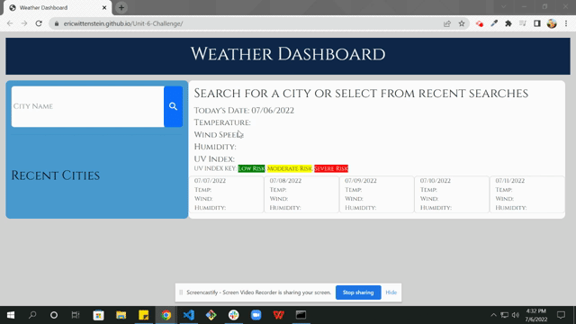

# Unit-6-Challenge
## Homework challenge for Unit 6: Server-Side APIs

## Having read the instructions, I have, to the best of my abilities, done the following:

- created a XXX
- added screenshots and links to this readme for the deployed application repo
- pushed my files to GitHub and deployed them to a live site through GitHub
- submitted the deployed application URL and GitHub repo to BCS for review and grading

[URL of Deployed Application](https://ericwittenstein.github.io/Unit-6-Challenge/)

<!-- EHW SIGNET
---------
    |
  -----
    |
---------
 -->

### Eric Wittenstein